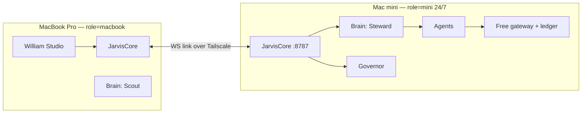

# PRD — Orchestra: Two-Device Agent OS

Owner: Willy · Repo: `jarvis-core` · Status: living document (v1, Oct 2026)

## 1. Vision

A personal agent operating system that runs on two Macs and costs nothing beyond the
existing Cursor subscription. The Mac mini is the always-on **control plane**; the MacBook
Pro is the **intake and thought machine** with a native app (William Studio) for speech
intake, a live view of every agent call, a system monitor, a built-in IDE and settings.
Both devices talk full-duplex over an encrypted link. There is an agent for everything,
every agent is defined by a README and a post-thought prompt, every input, decision,
problem, weakness and strength is journaled, and the system can heal itself.

## 2. Principles

| # | Principle | Meaning in code |
|---|-----------|-----------------|
| P1 | **Zero-token first** | Deterministic `rules` agents (Python/shell) run before any model. Rules → Ollama → free cloud → Cursor. |
| P2 | **Free only** | Free provider keys (Gemini, Groq, Codestral, OpenRouter, HF, Cloudflare, Cerebras…) via the gateway; Ollama is the always-available floor; Cursor only when asked. |
| P3 | **Agent for everything** | Every capability is an agent folder with `README.md` + `POSTTHOUGHT.md`. Agents may `require` other agents. |
| P4 | **Journal everything** | `journal` table: input, decision, problem, weakness, strength, fix. Post-thought writes into it. |
| P5 | **Observable** | Every call emits a span (`trace_id`, `span_id`, `parent_span_id`, device, agent, tokens, duration) streamed live to Studio. |
| P6 | **Governed** | A resource governor samples CPU/mem/thermal and pauses, cancels or keeps our own tasks. It never touches the user's apps without approval. |
| P7 | **Self-healing** | One button runs diagnostics, applies known fixes, and escalates unknowns into a sandbox branch for review. |
| P8 | **Safe** | Approval gates for irreversible actions remain; purchases are refused; keys never leave the Mini. |

## 3. Devices and roles



| | Mac mini (M4, 16 GB) | MacBook Pro |
|--|--|--|
| Role | control plane, queue, memory, gateway, keys, heavy agents | intake (speech), thought, UI, IDE |
| Brain persona | **Steward** — calm, long-horizon, resource-aware | **Scout** — fast, curious, clarifies then hands off |
| Always on | yes | no; reconnects and resumes |
| Holds keys | yes (`~/.config/jarvis/keys.env`) | never |
| Local models | Ollama (one at a time) | optional small Ollama |
| Config | `JARVIS_ROLE=mini` | `JARVIS_ROLE=macbook` |

Same codebase, same `jarvis/` package; role selects persona, enabled services and link
direction (MacBook initiates; Mini accepts).

## 4. Agent contract (summary; full spec in `AGENT_CONTRACT.md`)

```
jarvis/agents/<group>/<slug>/
  README.md        purpose, triggers, inputs/outputs, tools, requires, engine, budget, device
  POSTTHOUGHT.md   reflection prompt run after each task → journal entries
```

- `engine: rules | gateway | cursor`. `rules` agents point at a Python callable and use zero tokens.
- `requires:` lists agents that must be invoked (as child spans) to finish the job.
- `token_budget` per task; `device_affinity: mini | macbook | any`.
- `seed-agents.py` loads folders into the `specialist_agents` table idempotently.

## 5. Link protocol (summary; full spec in `LINK_PROTOCOL.md`)

Persistent WebSocket `/ws/link`, JSON envelopes with `trace_id/span_id/parent_span_id`,
heartbeat every 10 s, resume with backlog, both sides push. Transport: Tailscale first,
LAN mDNS fallback. Auth: fleet token + Tailscale identity.

## 6. Token economy

- Ledger per call: provider, key, model, tokens in/out, task, agent, device, cost(0).
- Quota Keeper knows free ceilings; keys rotate only **between** tasks when a key crosses
  80% of its ceiling. Never mid-stream.
- **Key Hunter** searches HN, Reddit, GitHub, DuckDuckGo for new free tiers and notifies
  with signup URL; keys are added by the user, probed, then join the chain.

## 7. Resource governor

Samples every 5 s: `top -l 1`, `vm_stat`, `pmset -g therm`, `ps`. Publishes
`GET /api/system/live`. Policy: memory pressure critical → pause queued heavy jobs; CPU
> 90% for 60 s from our tasks → cancel lowest-priority; thermal throttling → serialize
Ollama. Every decision is journaled and shown in Studio with keep/cancel buttons.

## 8. William Studio (MacBook, native SwiftUI, `swift build`)

1. **Intake** — push-to-talk / wake word → on-device STT → editable transcript → send.
2. **Call graph** — live DAG of devices → orchestrators → agents → tools; click for payload.
3. **System** — per-device CPU/mem/thermal, model load, queue, governor decisions.
4. **IDE** — file tree, editor with highlighting, terminal (SwiftTerm), git status/diff.
5. **Settings** — devices/link, personas, keys (masked), budgets, governor, approvals, skills, self-heal.

Source: `macos-helper/Sources/WilliamStudio/`. Install: `scripts/install-studio.sh` → `~/Applications/William Studio.app`
(ad-hoc signed; Info.plist carries speech + microphone usage strings). The app talks to the **local** core
(`http://127.0.0.1:8787`); on the MacBook the router forwards every non-rules prompt to the Mini (Scout → Steward)
and the Mini's spans/journal mirror back over the link, so the graph shows both devices.

## 9. Self-heal

`POST /api/selfheal` → diagnostics (health, launchd, ports, models, tests, journal problems)
→ known fixes (restart service, reinstall plist, pull model, clear cooldown, rotate log)
→ unknowns → `self_modify` sandbox branch → approval.

## 10. Skills and Mentor

- Skills installed with `skilz` / `npx skills` into `.agents/skills`; `scripts/sync-skills.sh`.
- Each agent README lists its skills; `skill_domains.py` maps domains to agents.
- **Mentor** = the UNKNOWN Business Coach skills (uni). Engine gateway, cooldown 24 h,
  triggers only on milestones (PRD change, pivot, pricing, launch, stuck ≥ 3 failures).

## 11. Milestones

| Phase | Deliverable | Done when |
|-------|-------------|-----------|
| 0 | Stable base + this PRD | tests green, services up, docs committed |
| 1 | Agent contract, journal, spans, rules engine, governor | `GET /api/journal`, `GET /api/system/live`, agents seeded from folders, rules agents answer with 0 tokens |
| 2 | Full-duplex link + MacBook bootstrap | MacBook runs core with role=macbook, link shows both devices, spans flow |
| 3 | Personas, token ledger, Key Hunter | `GET /api/tokens` per agent/device; Hunter posts an offer |
| 4 | William Studio | app installs via script, shows call graph live, IDE opens a repo |
| 5 | Self-heal, skills, Mentor | one-click heal fixes a killed service; Mentor fires on milestone only |

## 12. Risks

- 16 GB RAM: one local model at a time; governor enforces.
- Tailscale login and TCC (mic/screen) need the user once per device.
- Free-tier limits move; catalog must stay editable at runtime.
- Native IDE is large; ship tree + editor first.
