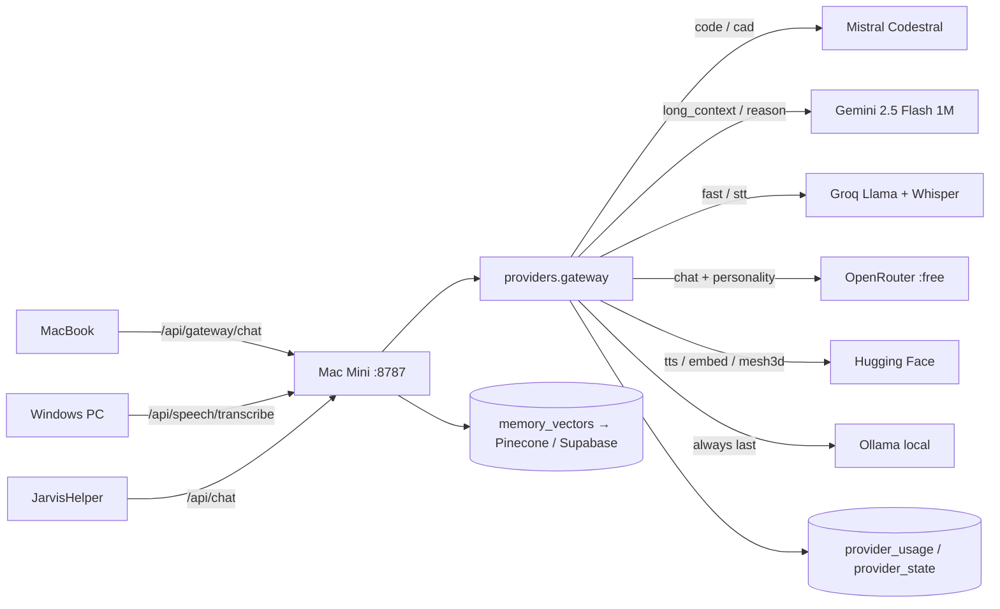

# Free AI Provider Gateway

One backend on the Mac Mini holds every free API key and routes each capability to the best free model.
The MacBook and Windows PC never hold keys — they call `POST /api/gateway/*` with the fleet token.



## Capability → chain (free_cloud_first)

| Capability | Order | Why |
|-----------|-------|-----|
| `code`, `cad` | Codestral → Mistral → Gemini 2.5 Flash → Groq 70B → OpenRouter → HF → Ollama | Codestral is built for code + FIM |
| `fast` | Groq Llama 3.1 8B → Gemini Flash-Lite → Mistral Small → Codestral → OpenRouter → Ollama | boilerplate, HTML/CSS/JS, React components in ms |
| `long_context` | Gemini 2.5 Flash (1M tokens) → OpenRouter → Groq → Mistral → Ollama | whole codebases, wireframes |
| `reason` | Gemini → Groq 70B → OpenRouter → Mistral → Ollama | grounded fact answers |
| `chat` | OpenRouter (:free, global personality) → Groq → Gemini → Mistral → HF → Ollama | conversation + memory |
| `stt` | Groq Whisper → HF whisper-large-v3 → local whisper.cpp | voice commands from either device |
| `tts` | HF (mms-tts / Bark) → macOS `say` | speech out |
| `embed` | Gemini → Mistral → HF MiniLM → Ollama nomic-embed-text | vector memory |
| `vector` | Pinecone → Supabase pgvector → local SQLite cosine | shared memory across devices |
| `mesh3d` | HF Space (TripoSR / InstantMesh) via `gradio_client` | image → .obj/.glb |

A provider is skipped when it has no key, is in cooldown (after 429 / 401 / 5xx), or has used its approximate
free daily/minute ceiling. **Ollama is always the final step**, so William never goes silent.
Paid keys through the Vigil proxy (OpenAI / Anthropic) sit after free cloud and before Ollama.

`JARVIS_GATEWAY_MODE`: `free_cloud_first` (default) · `local_first` (Ollama, then free cloud) · `local_only`.

`ollama.chat(...)` is still the one brain entry point for the whole codebase — it now calls the gateway with a
`capability` hint (`router.py` passes `code`, `reason`, `fast`, `chat`).

## Where keys live (Key Scout)

Searched in order: `JARVIS_<PROVIDER>_API_KEY` setting → process env → `~/.config/jarvis/keys.env` →
repo `.env` → `~/.config/<provider>/api_key` (+ HF token cache) → macOS Keychain service `jarvis-<provider>`.

| Provider | Env var | Sign up |
|----------|---------|---------|
| Google AI Studio (Gemini 2.5 Flash, embeddings) | `GEMINI_API_KEY` | https://aistudio.google.com/apikey |
| Mistral (Codestral, mistral-embed) | `MISTRAL_API_KEY` | https://console.mistral.ai/api-keys |
| Codestral dedicated endpoint | `CODESTRAL_API_KEY` | https://console.mistral.ai/codestral |
| Groq (Llama 3.3 70B / 3.1 8B, Whisper) | `GROQ_API_KEY` | https://console.groq.com/keys |
| Hugging Face (Whisper, TTS, MiniLM, Spaces) | `HF_TOKEN` | https://huggingface.co/settings/tokens |
| OpenRouter (:free models, personality) | `OPENROUTER_API_KEY` | https://openrouter.ai/settings/keys |
| Pinecone (vector memory) | `PINECONE_API_KEY` + `JARVIS_PINECONE_INDEX_HOST` | https://app.pinecone.io/ |
| Supabase (pgvector memory) | `SUPABASE_SERVICE_KEY` + `JARVIS_SUPABASE_URL` | https://supabase.com/dashboard |

Save a key without touching the repo:

```bash
curl -s -X POST http://127.0.0.1:8787/api/providers/keys \
  -H 'Content-Type: application/json' \
  -d '{"provider":"groq","key":"gsk_..."}'
# → written to ~/.config/jarvis/keys.env (0600), probed, visible to the running process immediately
```

Or by voice / chat: "scan for keys", "which AI keys do we have", "api usage".

## Endpoints

| Endpoint | Purpose |
|----------|---------|
| `GET /api/providers` | Full overview: keys, chains, usage, cooldowns, signup URLs |
| `GET /api/providers/keys` | Present / missing keys (masked) |
| `POST /api/providers/scan` | Key Scout: rescan every location now |
| `POST /api/providers/probe[?provider=]` | Cheap validity probe (list models / whoami) |
| `POST /api/providers/keys` · `DELETE /api/providers/keys/{p}` | Save / remove a key (fleet token) |
| `GET /api/providers/usage?days=7&recent=50` | Quota Keeper ledger |
| `GET /api/providers/shopping-list` | What to sign up for next |
| `POST /api/providers/open-signup/{p}` | Open the signup page on the Mini |
| `GET /api/gateway/status` | Mode, configured providers, per-capability chains, last decision |
| `POST /api/gateway/chat` | `{message | messages, system, capability, prefer}` → `{reply, provider, model, attempts}` |
| `POST /api/gateway/fim` | Codestral fill-in-the-middle `{prefix, suffix}` |
| `POST /api/gateway/embed` | `{texts}` → vectors |
| `GET /api/memory/semantic?q=` | Semantic memory search |
| `POST /api/speech/transcribe` (multipart) · `POST /api/speech/tts` | Speech in / out |
| `GET /api/cad/status` · `POST /api/cad/generate` | OpenSCAD / Blender / HF mesh |
| `POST /api/icons/generate` · `POST /api/icons/apply-all` | App icons |

Device CLI: [`fleet-worker/ask.py`](../fleet-worker/ask.py).

## Agents (seeded by `scripts/seed-fleet-agents.py`)

| Agent | Job | Backing jobs / code |
|-------|-----|---------------------|
| **Key Scout** | find / validate / save keys, hand out signup URLs | `providers/keys.py`, `scout.scan_keys`, scheduler `provider_key_scan` (30 min), `provider_probe` (6 h) |
| **Quota Keeper** | usage vs free ceilings, cooldowns, re-routing advice | `providers/usage.py`, `scout.usage_rollup` nightly 00:20 |
| **Model Router** | explains / drives the capability chains | `providers/gateway.py` |
| **Speech Engineer** | STT / TTS across devices | `providers/speech.py` |
| **Memory Keeper** | embeddings + vector memory + personality prompt | `providers/vectors.py`, `memory.py`, `JARVIS_PERSONALITY_PROMPT` |
| **CAD Smith** | OpenSCAD / Blender / HF mesh | `providers/cad.py` → `exports/cad/` |
| **Icon Smith** | icons for every built or shipped app | `app_icons.py`, build pipeline integration step |

Provider agents run `model: gateway` (free chain directly); fleet agents keep Cursor first with the gateway as fallback.
All agents get a live facts block (keys, usage, tool availability) injected so they never guess.

## Memory & personality

- Local embeddings need the Ollama embed model once: `ollama pull nomic-embed-text` (768-dim, ~270 MB). Cloud keys (Gemini / Mistral / HF) are used first when present.
- Every `memory.store()` is embedded and written to `memory_vectors` (SQLite); mirrored to Pinecone / Supabase when configured.
- `memory.retrieve()` merges FTS keyword hits with cosine hits (`min_score` 0.35).
- Supabase table + RPC expected:

```sql
create extension if not exists vector;
create table if not exists jarvis_memories (
  id text primary key, content text, kind text, importance int, topic text, embedding vector(768));
create or replace function match_jarvis_memories(query_embedding vector(768), match_count int)
returns table (id text, content text, kind text, importance int, topic text, similarity float)
language sql stable as $$
  select id, content, kind, importance, topic, 1 - (embedding <=> query_embedding) as similarity
  from jarvis_memories order by embedding <=> query_embedding limit match_count; $$;
```

(Adjust the dimension to the embedding model that wins the chain — Gemini 3072, Mistral 1024, MiniLM 384, nomic 768.)

## 3D CAD

LLMs cannot emit `.step`/`.stl`; CAD Smith generates **OpenSCAD** (compiled to `.stl` with the OpenSCAD CLI) or a
**Blender bpy** script (run headless → `.obj`). Image → mesh uses a public HF Space through `gradio_client`.

```bash
brew install --cask openscad blender          # optional local compilers
.venv/bin/pip install gradio_client            # optional HF Spaces client
curl -s -X POST :8787/api/cad/generate -d '{"prompt":"phone stand 70° with cable slot"}' -H 'Content-Type: application/json'
```

Output: `exports/cad/<slug>-<timestamp>/model.scad|.stl`. Review with the `cad-viewer` skill.

## App icons

`jarvis/services/app_icons.py` (stdlib only): initials + deterministic palette → SVG → PNG (`qlmanage`, pure-Python fallback)
→ `.icns` (`iconutil`) → favicon `.ico` + PWA `manifest.webmanifest`.

- Installers (`install-helper.sh`, `install-kiosk.sh`, `install-desktop-app.sh`, `install-system-map-app.sh`) apply an icon before signing.
- The build pipeline applies an icon to every project at the integration step (web → `public/`, Swift → `Resources/`, other → `assets/`).
- `./scripts/apply-app-icons.sh` refreshes every known bundle and `~/Projects/willy-build-*`.
